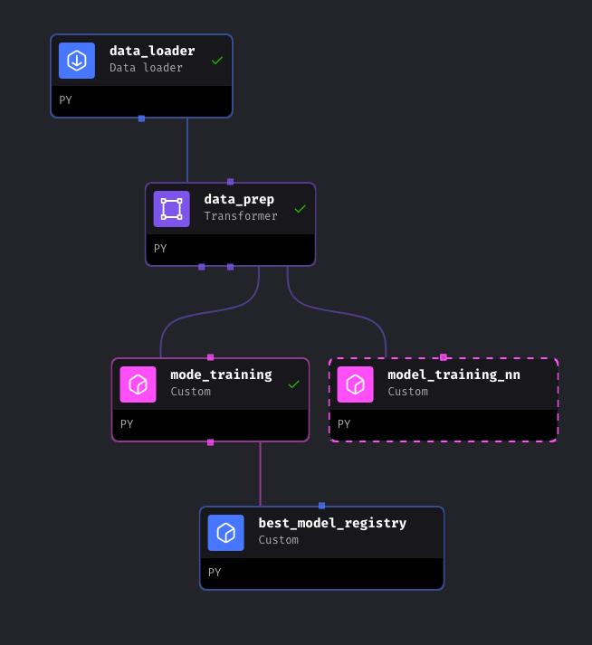
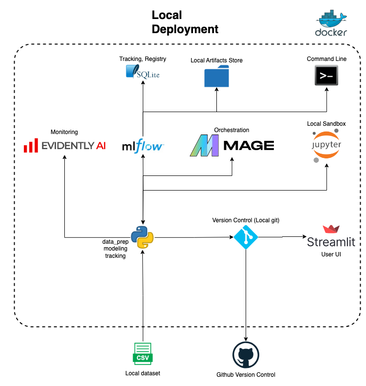

# MLOps-project

# MLOps Zoomcamp Project

## Flight Price Prediction

### 1. Problem Statement
If you want to book a flight chances that you will find several places offer the same flight with different prices. The question is, how do you know that you are getting a good deal? what is the average prices for your flight and what are the factors that play in the price prediction. This project isn't focused to perform full prediction model to predict the price, but rather to build couple of basic models and use that as a component in our MLOps project. 

\
*Generated using Google Gemini*

- [X] Clear problem statement, describes the business need, the stakeholders and ROI of the the solution

### 2. Dataset

The dataset used in the project is [flights iternaries from Expedia](https://www.kaggle.com/datasets/dilwong/flightprices) for the period between 2022-04-16 and 2022-10-05. Total of **27** columns and 82,138,754 rows. File size is ~30GB. More information about the meta data can be accessed in [Dillon Wong's Github Repo](https://github.com/dilwong/FlightPrices). 

- [x] Find a suitable dataset that can help answering the business question above

### 3. Data Prep (data_prep.py)
This function does the needed data cleansing, dates conversion. Additionl features were created (hours, day, month) for both arrival and departure dates columns.
#### 3.1. Partial Data Loader (partial_data_loader.py)
This function partially loads the csv file by specifying number of rows to sample.
#### 3.2. Full Data Loader (full_data_loader.py)
This function loads the full dataset (~30GB)
#### 3.3. Data Prep (data_prep.py)
This script processes the raw data and output a subset of the columns that we want to include them in our project, it also creates an extra feature (days before travel) to be added to the predictors set. The output dataframe will be used in the modeling module. It also cleans up the dataset and converts the linux style dates to a month, day, hour columns. It's worth mentioning here that our focus is on the the MLOps part, so data preparation was kept to minimal.

- [x] Data Loader
- [ ] Add making small dataset code to the initialization code
- [x] Create a feature (Days before trip)
- [x] Data Prep
- [x] Ferature Engineering

### 3. Modeling (modeling.py)
- [x] Basic Modeling
- [x] Prediction
- [x] Tracking
- [ ] Evaluation
- [ ] Monitoring
- [ ] Serving
- [ ] Model GUI

#### 3.1 Models
I have tried three models:
* LinearRegression
* Lasso
* Ridge

evaulation metrics were R^2, RMSE and both were logged along with training visuals.

#### 3.2 Orchestration and Training
Mage was used to achieve the training, logging, registry and serving. Couple of issues were faced due to the size of the data, the product itself is relatively new. Below is a screenshot for one of the pipelines.

#### 3.3 Tracking
Mlflow was used to track modeling expirements, register models and serve a command line interface to test the model. Another helper function was created to perform most of the logging tasks.

#### 3.4 Registry
#### 3.3 Monitoring and Evaluation
### Deployment
#### Local Deployment 

#### 3.6 Retraining Orchestration

#### 3.7 Serving and Packaging

#### 3.8 Model Interaction GUI

### 4. Best Practices

### 5. Tecchnologies Used

### 6. Execusion Examples

---

Copied from dtc-mlops - zoomcamp

## Course Project

Video: https://www.loom.com/share/8f99d25893de4fb8aaa95c0395c740b6

### Objective

The goal of this project is to apply everything we have learned
in this course to build an end-to-end machine learning project.

## Problem statement

For the project, we will ask you to build an end-to-end ML project. 

For that, you will need:

* Select a dataset that you're interested in (see [Datasets](#datasets))
* Train a model on that dataset tracking your experiments
* Create a model training pipeline
* Deploy the model in batch, web service or streaming
* Monitor the performance of your model
* Follow the best practices 

## Technologies 

You don't have to limit yourself to technologies covered in the course. You can use alternatives as well:

* **Cloud**: AWS, GCP, Azure, ... 
* **Experiment tracking tools**: MLFlow, Weights & Biases, ... 
* **Workflow orchestration**: Prefect, Airflow, Flyte, Kubeflow, Argo, ...
* **Monitoring**: Evidently, WhyLabs/whylogs, ...
* **CI/CD**: Github actions, Gitlab CI/CD, ...
* **Infrastructure as code (IaC)**: Terraform, Pulumi, Cloud Formation, ...

If you use a tool that wasn't covered in the course, be sure to explain what that tool does.

If you're not certain about some tools, ask in Slack.

## Peer reviewing

> [!IMPORTANT]  
> To evaluate the projects, we'll use peer reviewing. This is a great opportunity for you to learn from each other.
> * To get points for your project, you need to evaluate 3 projects of your peers
> * You get 3 extra points for each evaluation

## Evaluation Criteria

* Problem description
    * 0 points: The problem is not described
    * 1 point: The problem is described but shortly or not clearly 
    * 2 points: The problem is well described and it's clear what the problem the project solves
* Cloud
    * 0 points: Cloud is not used, things run only locally
    * 2 points: The project is developed on the cloud OR uses localstack (or similar tool) OR the project is deployed to Kubernetes or similar container management platforms
    * 4 points: The project is developed on the cloud and IaC tools are used for provisioning the infrastructure
* Experiment tracking and model registry
    * 0 points: No experiment tracking or model registry
    * 2 points: Experiments are tracked or models are registered in the registry
    * 4 points: Both experiment tracking and model registry are used
* Workflow orchestration
    * 0 points: No workflow orchestration
    * 2 points: Basic workflow orchestration
    * 4 points: Fully deployed workflow 
* Model deployment
    * 0 points: Model is not deployed
    * 2 points: Model is deployed but only locally
    * 4 points: The model deployment code is containerized and could be deployed to cloud or special tools for model deployment are used
* Model monitoring
    * 0 points: No model monitoring
    * 2 points: Basic model monitoring that calculates and reports metrics
    * 4 points: Comprehensive model monitoring that sends alerts or runs a conditional workflow (e.g. retraining, generating debugging dashboard, switching to a different model) if the defined metrics threshold is violated
* Reproducibility
    * 0 points: No instructions on how to run the code at all, the data is missing
    * 2 points: Some instructions are there, but they are not complete OR instructions are clear and complete, the code works, but the data is missing
    * 4 points: Instructions are clear, it's easy to run the code, and it works. The versions for all the dependencies are specified.
* Best practices
    * [ ] There are unit tests (1 point)
    * [ ] There is an integration test (1 point)
    * [ ] Linter and/or code formatter are used (1 point)
    * [ ] There's a Makefile (1 point)
    * [ ] There are pre-commit hooks (1 point)
    * [ ] There's a CI/CD pipeline (2 points)

> [!NOTE]
> It's highly recommended to create a new repository for your project (not inside an existing repo) with a meaningful title, such as
> "Car Price Prediction" or "Music Genre Classification" and include as many details as possible in the README file. ChatGPT can assist you with this. Doing so will not only make it easier to showcase your project for potential job opportunities but also have it featured on the [Projects Gallery App](#projects-gallery).
> If you leave the README file empty or with minimal details, there may be point deductions as per the [Evaluation Criteria](#evaluation-criteria).

## Resources

### Datasets

Refer to the provided [datasets](https://github.com/DataTalksClub/data-engineering-zoomcamp/blob/main/projects/datasets.md) for possible selection.

### Projects Gallery

Explore a collection of projects completed by members of our community. The projects cover a wide range of topics and utilize different tools and techniques. Feel free to delve into any project and see how others have tackled real-world problems with data, structured their code, and presented their findings. It's a great resource to learn and get ideas for your own projects.

### MLOps Zoomcamp 2023

* [2023 Projects](../cohorts/2023/07-project)

### MLOps Zoomcamp 2022

* [2022 Projects](../cohorts/2022/07-project)

