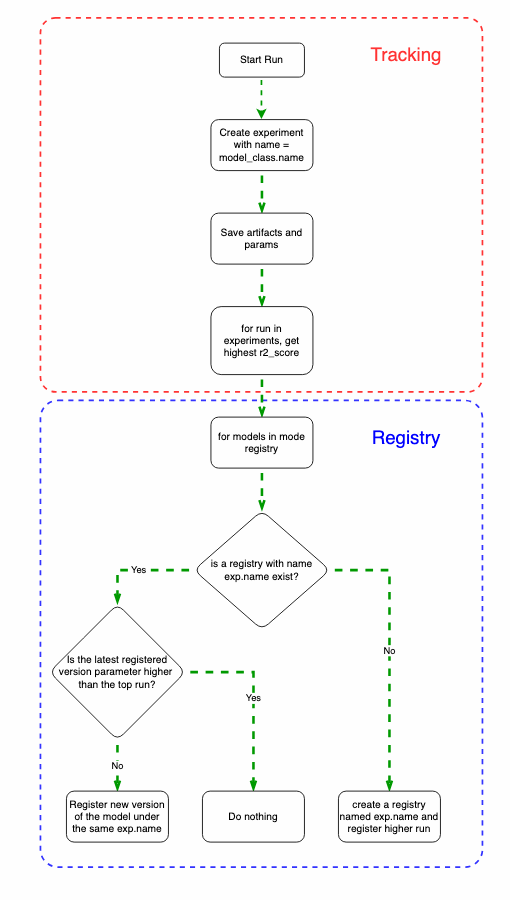
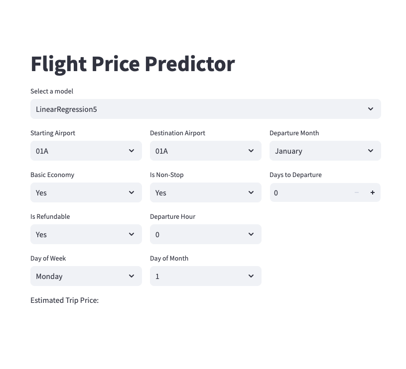

# MLOps Zoomcamp Project

## Flight Price Prediction

### 1. Problem Statement
If you want to book a flight chances that you will find several places offer the same flight with different prices. The question is, how do you know that you are getting a good deal? what is the average prices for your flight and what are the factors that play in the price prediction. This project isn't focused to perform full prediction model to predict the price, but rather to build couple of basic models and use that as a component in our MLOps project. 

\
*Generated using Google Gemini*

- [X] Clear problem statement, describes the business need, the stakeholders and ROI of the the solution

### 2. Dataset

The dataset used in the project is [flights iternaries from Expedia](https://www.kaggle.com/datasets/dilwong/flightprices) for the period between 2022-04-16 and 2022-10-05. Total of **27** [ ] columns and 82,138,754 rows. File size is ~30GB. More information about the meta data can be accessed in [Dillon Wong's Github Repo](https://github.com/dilwong/FlightPrices). 

- [x] Find a suitable dataset that can help answering the business question above

### 3. Data Prep (data_prep.py)
This function does the needed data cleansing, dates conversion. Additionl features were created (hours, day, month) for both arrival and departure dates columns.
#### 3.1. Partial Data Loader (partial_data_loader.py)
This function partially loads the csv file by specifying number of rows to sample.
#### 3.2. Full Data Loader (full_data_loader.py)
**Warning** [ ] This function loads the full dataset (~30GB)
#### 3.3. Data Prep (data_prep.py)
This script processes the raw data and output a subset of the columns that we want to include them in our project, it also creates an extra feature (days before travel) to be added to the predictors set. The output dataframe will be used in the modeling module. It also cleans up the dataset and converts the linux style dates to a month, day, hour columns. It's worth mentioning here that our focus is on the the MLOps part, so data preparation was kept to minimal.
- [x] Data Loader
- [x] Create a feature (Days before trip)
- [x] Data Prep
- [x] Ferature Engineering
### 4. Modeling (modeling.py)
- [x] Basic Modeling
- [x] Prediction
- [x] Tracking
- [ ] Evaluation
- [ ] Monitoring
- [x] Serving
- [x] Model GUI
#### 4.1 Models
I have tried three models:
* [ ] LinearRegression
* [ ] Lasso
* [ ] Ridge
* [ ] RandomForest
* [ ] Neural Networks
evaulation metrics were R^2, RMSE and both were logged along with training visuals.
#### 4.2 Orchestration and Training
Mage was used to achieve the training, logging, registry and serving. Couple of issues were faced due to the size of the data, the product itself is relatively new. Below is a screenshot for one of the pipelines.

#### 4.3 Tracking and Registry
Mlflow was used to track modeling expirements, register models and serve a command line interface to test the model. Another helper function was created to perform most of the logging tasks. I decided to write a whole module for the tracking and regitry, the logic of the model is explained in the following chart. The model creates a new experiment per algorithm, and picks the top runs of this experiment to register them in the model registry, if a registry is exist the it will update the model version if we got better r²_test value.

#### 4.5 Monitoring and Evaluation
#### 4.6 Model Interaction GUI
Streamlit was deployed as a service within the docker stack to communicate with the mlflow service. A dropdown list of the registered models from the model registery is available. The rest of the inputs to the model are provided in the same UI, the prediction is done automatically once any value changes.

### 4. Deployment and Usage
#### 4.1 Local Deployment
In order to deploy the model locally follow these steps, start by clonning the repo:
- `git clone https://github.com/atheeralattar/mlops-project.git`
- `cd mlops-project`
- `docker-compose up`
- available services are:
  - Mage UI at http://0.0.0.0:6789
  - Mlflow UI at http://0.0.0.0:5000
  - Streamlit UI at http://0.0.0.0:8501
and you can simply interact with the model from the Streamlit UI.

#### 4.2 Cloud Deployment

### 5. Best Practices

### 6. Tecchnologies Used

### 7. Lessons learned and Technical Debt
#### 7.1. Lessons Learned
#### 7.2. Techincal Debt
* Streamlit functionality needs to be redesigned.
* Mlflow functions need to be redesigned to abstract them out from the training functions.
* Separate prediction functionality from streamlit
* 

---

## Evaluation Criteria - Copied from DTZC

* [ ] Problem description
    * [ ] 0 points: The problem is not described
    * [ ] 1 point: The problem is described but shortly or not clearly 
    * [x] 2 points: The problem is well described and it's clear what the problem the project solves
* [ ] Cloud
    * [ ] 0 points: Cloud is not used, things run only locally
    * [ ] 2 points: The project is developed on the cloud OR uses localstack (or similar tool) OR the project is deployed to Kubernetes or similar container management platforms
    * [ ] 4 points: The project is developed on the cloud and IaC tools are used for provisioning the infrastructure

* [ ] Experiment tracking and model registry
    * [ ] 0 points: No experiment tracking or model registry
    * [ ] 2 points: Experiments are tracked or models are registered in the registry
    * [x] 4 points: Both experiment tracking and model registry are used
  
* [ ] Workflow orchestration
    * [ ] 0 points: No workflow orchestration
    * [ ] 2 points: Basic workflow orchestration
    * [x] 4 points: Fully deployed workflow 

* [ ] Model deployment
    * [ ] 0 points: Model is not deployed
    * [x] 2 points: Model is deployed but only locally
    * [ ] 4 points: The model deployment code is containerized and could be deployed to cloud or special tools for model deployment are used

* [ ] Model monitoring
    * [x] 0 points: No model monitoring
    * [ ] 2 points: Basic model monitoring that calculates and reports metrics
    * [ ] 4 points: Comprehensive model monitoring that sends alerts or runs a conditional workflow (e.g. retraining, generating debugging dashboard, switching to a different model) if the defined metrics threshold is violated

* [ ] Reproducibility
    * [ ] 0 points: No instructions on how to run the code at all, the data is missing
    * [ ] 2 points: Some instructions are there, but they are not complete OR instructions are clear and complete, the code works, but the data is missing
    * [x] 4 points: Instructions are clear, it's easy to run the code, and it works. The versions for all the dependencies are specified.
* [ ] Best practices
    * [ ] There are unit tests (1 point)
    * [ ] There is an integration test (1 point)
    * [ ] Linter and/or code formatter are used (1 point)
    * [ ] There's a Makefile (1 point)
    * [ ] There are pre-commit hooks (1 point)
    * [ ] There's a CI/CD pipeline (2 points)
